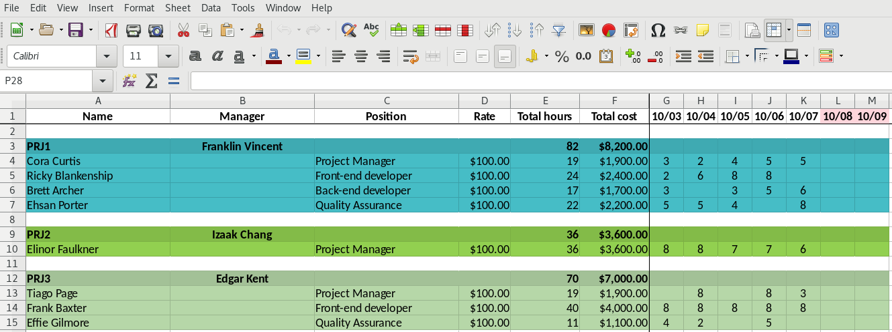

# PM Report
Automates the creation of reports for managers using Jira and Tempo plugin with export to Excel table.

## High-level Architecture


## Requirements

- [Go 1.18](https://go.dev/dl/)
- [GNU Make](https://www.gnu.org/software/make/)

## Preparing

Create Tempo token at `Jira/Tempo API Integration` page and create new token with read permissions.


Usually, url is like:
```text
https://<COMPANY>.atlassian.net/plugins/servlet/ac/io.tempo.jira/tempo-app#!/configuration/api-integration
``` 

## Configuration

Change `AppConfig.yaml` according to required preferences:
```yaml
files:
  project_config: <PREFIX>_ProjectConfig.xlsx
  report: <PREFIX>_Report.xlsx

tempo:
  url: https://api.tempo.io
  tokens:
    - token: <TEMPO_TOKEN>
      projects: <PROJECT_LIST>

    - token: <TEMPO_TOKEN>
      projects: <PROJECT_LIST>
```

Placeholders:
- `<PREFIX>` - any prefix (usually it is current year).
- `<TEMPO_TOKEN>` - tempo token created for specific company domain in Jira.
- `<PROJECT_LIST>` - comma separated list of projects (without whitespaces).

## Run

Initially, before each usage it is needed to actualize `<PROJECT_LIST>` in `AppConfig.yaml` file.
Then, tool can be run this way:
```text
./pm-report <MONTH> <YEAR> <APP_CONFIG>
```

where:
- `<MONTH>` - month for report (can be number: `1-12` or name `Dec` or `December`).
- `<YEAR>` (optional) - year for report (Default: `current year`).
- `<APP_CONFIG>` (optional) - application config file (Default: `AppConfig.yaml`).

When execution finished, two new files will be created:
- `<PREFIX>_ProjectConfig.xlsx` - where employee's `Position` and `Rate` should be filled.
- `<PREFIX>_Report.xlsx` - actually, report.

Examples:
```text
./pm-report 8
./pm-report Aug
./pm-report August

./pm-report 8 2022
./pm-report Aug 2022
./pm-report August 2022

./pm-report 8 2022 CustomAppConfig.yaml
./pm-report Aug 2022 CustomAppConfig.yaml
./pm-report August 2022 CustomAppConfig.yaml
```

## Features

After the first run the project config file will be created.
It is required to fill `Position` and `Rate` columns there to obtain valid calculations in report.
Also, would be nice to have `Display Name`, `Owner` and `Manager` filled.

After that, run reporter again with the same parameters and report file will be updated.

The new employees will be added to the project config file automatically.
The existing employees are not removed automatically.

## Example of project config


## Example of report



## Development

### Update dependencies
```text
go mod tidy && go mod vendor
```

### Build

To make a cross-build, please see available platforms:
```text
go tool dist list
```

For example, for linux run this command to create a binary file for `linux/amd64` architecture:
```text
GOOS=linux GOARCH=amd64 go build
```

For batch build use [Makefile](Makefile) and run:
```text
make build
```
It will create `builds` directory with compiled binary files according to preconfigured set of platforms.
